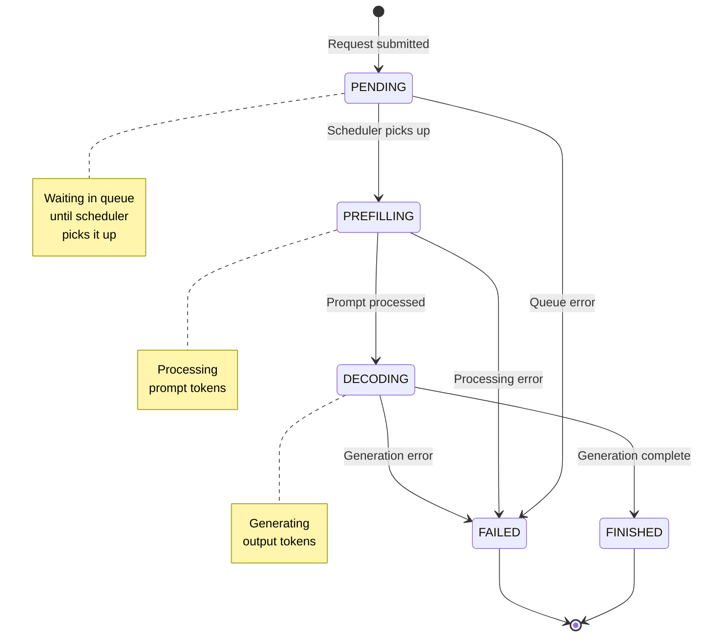
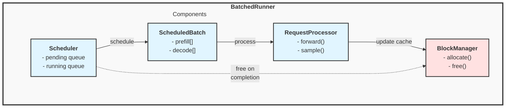
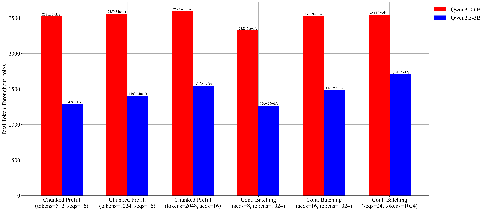
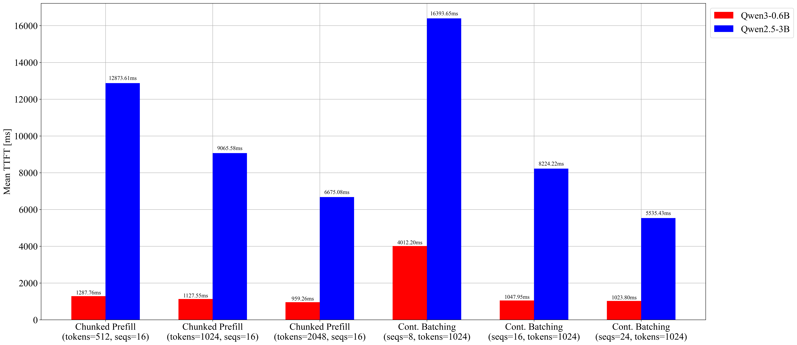
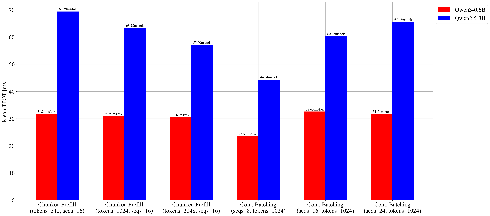
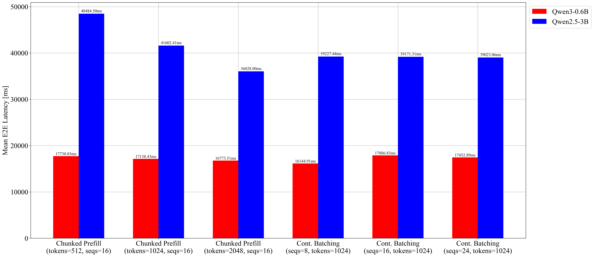

# Building an LLM Inference Engine from Scratch (Part 2)

> **How Continuous Batching and Chunked Prefill Maximize Throughput**

---

## 1. Introduction

[Part 1](./Part1_CoreArchitecture_PagedAttention.md) covered PagedAttention: block-based KV cache management that eliminates memory fragmentation. But efficient memory for individual requests is only half the story — real serving must handle **multiple concurrent requests**. This part covers:

1. **Continuous Batching**: Schedule at iteration-level, not request-level
2. **Chunked Prefill**: Prevent long prompts from blocking decode

---

## 2. The Problem: Request-Level Batching

In traditional batching, we group requests and process them as a unit. But requests have different lengths:

```
Request A: 10 prompt tokens → 50 generated tokens
Request B: 100 prompt tokens → 20 generated tokens
Request C: 5 prompt tokens → 200 generated tokens

Static Batch: Process all → Generate until ALL finish → Return all results
```

**Problems:**

1. **Head-of-line blocking**: Fast requests (B) wait for slow requests (C)
2. **Underutilization**: After A and B finish, their compute slots sit idle
3. **Latency**: New requests wait for entire batch to complete

```
Iteration  1   10   20   30   40   50   ...  200
           ├────┼────┼────┼────┼────┼────...──┤

Request A: [████████████████████████]            Finishes at 60
Request B: [███████████████]                     Finishes at 120
Request C: [████████████████████████████████████████████████████]  Finishes at 205

Wasted:    [                        ░░░░░░░░░░░░░░░░░░░░░░░░░░░░]  A's slot idle
           [               ░░░░░░░░░░░░░░░░░░░░░░░░░░░░░░░░░░░░░]  B's slot idle
```

---

## 3. Continuous Batching

### 3.1. Core Idea

**Iteration-level scheduling**: Instead of waiting for an entire batch to complete, evaluate which requests to process at **each iteration**. Requests can **join** and **leave** the batch at any iteration.

### 3.2. The Effect

```
Request-Level Batching:
                           ↓ Batch 1 must finish before Batch 2 starts
Batch 1: [A████████] [B██████████████] [C████]     ← Wait for longest (B)
Batch 2:                                [D████████] [E██████]  ← D, E wait
         ├──────── Batch 1 (wasted slots) ────────├── Batch 2 ──┤

Continuous Batching:
Slot 1:  [A████████] [D████████████]                ← D joins when A finishes
Slot 2:  [B██████████████] [E██████]                ← E joins when B finishes
Slot 3:  [C████] [F████████] [G████████████]        ← Slot reused multiple times
         ├──────────── all slots stay full ──────────────┤
```

No wasted slots — when a request finishes, the next pending request takes its place immediately.

### 3.2.1. Experiment Summary

**GPU** (Qwen3-0.6B, RTX 3060, batch_size=8, 20 mixed-length requests):

| Mode | Output tok/s | Wall Time | TTFT p50 | Wasted Decode Slots |
|------|-------------|-----------|----------|---------------------|
| Request-Level | 3.6 | 253.9 s | 170.4 s | 1,528 |
| Continuous | 16.7 | 54.0 s | 10.8 s | 0 |

**4.7x throughput**, **15.7x TTFT improvement**, zero wasted slots. Batched requests share parallel matrix operations (fused GEMM), so more requests per batch means better hardware utilization.

**CPU** (stories15M, 6 mixed-length requests): Continuous batching is **2.2% slower** (768 → 752 tok/s) — the "batch" is a scheduling abstraction with no compute parallelism, so the scheduler adds pure overhead. Despite this, it still provides **scheduling fairness**: shorter requests finish earlier instead of waiting for the entire batch. See [Appendix A](#appendix-a-benchmark-results) for full results.

### 3.3. Request States

```cpp
enum class RequestStatus {
    PENDING,     // In queue, waiting to be scheduled
    PREFILLING,  // Processing prompt tokens
    DECODING,    // Generating tokens
    FINISHED,    // Completed
    FAILED       // Error occurred
};
```



### 3.4. Scheduler Design

The scheduler builds a `ScheduledBatch` each iteration — a list of prefill and decode requests that fit within the token budget.

**Key design choice**: Decode requests get priority over prefill because decode costs 1 token per request while prefill costs many. This keeps in-progress requests moving and minimizes time-to-completion.

```cpp
ScheduledBatch schedule() {
    ScheduledBatch batch;

    // Priority 1: Decode requests (already in progress, 1 token each)
    for (auto* req : running_requests_) {
        if (req->status == RequestStatus::DECODING) {
            if (batch.total_requests() >= config_.max_batch_size) break;
            batch.decode_requests.push_back(req);
        }
    }

    // Priority 2: Prefill requests (new from queue, many tokens each)
    int remaining_slots = config_.max_batch_size - batch.total_requests();
    int current_tokens = batch.total_prefill_tokens() + batch.total_decode_tokens();

    while (!pending_queue_.empty() && remaining_slots > 0) {
        Request* req = pending_queue_.front();
        int req_tokens = req->num_prompt_tokens();

        if (current_tokens + req_tokens > config_.max_tokens_per_batch) break;

        pending_queue_.pop();
        req->status = RequestStatus::PREFILLING;
        running_requests_.push_back(req);
        batch.prefill_requests.push_back(req);

        current_tokens += req_tokens;
        remaining_slots--;
    }

    return batch;
}
```

---

## 4. Chunked Prefill

### 4.1. The Problem: Prefill Blocks Decode

Prefill is compute-intensive — a 2048-token prompt monopolizes the forward pass, stalling all decode requests:

```
Prefill:  [████████████████████████████████████████████████████] 2048 tokens
Decode:   [░░░░░░░░░░░░░░░░░░░░░░░░░░░░░░░░░░░░░░░░░░░░░░░░░] BLOCKED!

Users streaming tokens from decode requests see their output stall.
```

### 4.2. The Solution: Chunk the Prompt

Split prefill into smaller pieces and **interleave** with decode:

```
Without Chunking:
  Prefill: [████████████████████████████████████████] 2048 tokens at once
  Decode:  [░░░░░░░░░░░░░░░░░░░░░░░░░░░░░░░░░░░░░░] blocked entire time

With Chunking (chunk_size=256):
  Iter 1:  [████] 256 prefill + [●●●] decode tokens
  Iter 2:  [████] 256 prefill + [●●●] decode tokens  ← decode continues!
  Iter 3:  [████] 256 prefill + [●●●] decode tokens
  ...
  Iter 8:  [████] 256 prefill + [●●●] decode tokens  ← prefill complete
           └────┘               └───┘
           prefill chunk        decode (not blocked!)
```

Decode requests produce tokens every iteration instead of stalling for the entire prefill.

### 4.2.1. Experiment Summary

**GPU** (Qwen3-0.6B, RTX 3060, vLLM, 20 prompts, ~4096 input tokens, max_num_seqs=16):

| Config | Output tok/s | Mean TTFT | Mean TPOT |
|--------|-------------|-----------|-----------|
| No chunk | 278.3 | 1,048 ms | 32.6 ms |
| Chunk 512 | 277.9 | 1,288 ms | 31.8 ms |
| Chunk 1024 | 282.2 | 1,128 ms | 31.0 ms |
| Chunk 2048 | 285.9 | 959 ms | 30.6 ms |

Chunked prefill maintains throughput while improving **TPOT consistency** — decode requests are no longer blocked by long prefills. Larger chunks favor throughput; smaller chunks bound worst-case decode latency.

**CPU** (stories15M, 6 mixed-length requests): Chunked prefill is **roughly throughput-neutral** (752 → 755 tok/s) while improving **decode throughput by +1.8%** (517 → 526 tok/s). The slight prefill slowdown (-1.9%) comes from chunk boundary overhead. See [Appendix A](#appendix-a-benchmark-results) for full results.

### 4.3. Implementation

Chunked prefill requires three changes:

#### Request: Track prefill progress (`include/scheduler/request.hpp`)

```cpp
struct Request {
    int prefill_cursor = 0;  // How many prompt tokens processed so far

    bool is_prefill() const { return prefill_cursor < num_prompt_tokens(); }
    int  remaining_prompt() const { return num_prompt_tokens() - prefill_cursor; }
};
```

#### Scheduler: Allocate chunk sizes from token budget (`include/scheduler/scheduler.hpp`)

```cpp
// Continue prefill for requests already running (chunked)
for (auto *req : running_requests_) {
    if (req->status != RequestStatus::PREFILLING) continue;

    int remaining   = req->remaining_prompt();
    int budget_left = config_.max_tokens_per_batch - batch.total_scheduled_tokens;
    int chunk_size  = std::min(remaining, budget_left);

    if (chunk_size <= 0) break;
    batch.add(req, chunk_size);
}

// Admit new prefill requests from pending queue
while (!pending_queue_.empty()) {
    Request *req    = pending_queue_.front();
    int budget_left = config_.max_tokens_per_batch - batch.total_scheduled_tokens;
    int chunk_size  = std::min(req->remaining_prompt(), budget_left);

    if (chunk_size <= 0) break;

    pending_queue_.pop();
    req->status = RequestStatus::PREFILLING;
    running_requests_.push_back(req);
    batch.add(req, chunk_size);
}
```

#### Runner: Process only the scheduled chunk (`include/scheduler/batched_runner.hpp`)

```cpp
void run_prefill_batch(ScheduledBatch &batch, Scheduler &scheduler) {
    for (size_t i = 0; i < batch.requests.size(); i++) {
        Request *req          = batch.requests[i];
        int      tokens_to_do = batch.scheduled_tokens[i];  // Chunk size

        for (int t = 0; t < tokens_to_do; t++) {
            int token_idx = req->prefill_cursor + t;
            model_.forward_with_request(req->prompt_tokens[token_idx], req->current_pos, req);
            req->current_pos++;
        }
        req->prefill_cursor += tokens_to_do;

        if (!req->is_prefill()) {
            req->status = RequestStatus::DECODING;  // Entire prompt processed
        }
    }
}
```

### 4.4. Chunk Size Trade-off

| Chunk Size           | Prefill Efficiency          | Decode Latency              |
| -------------------- | --------------------------- | --------------------------- |
| Very Small (16)      | Poor: overhead dominates    | Excellent: minimal blocking |
| Very Large (2048)    | Excellent: like no chunking | Poor: blocks decode         |
| Sweet Spot (256-512) | Good                        | Good                        |

---

## 5. Putting It All Together

### 5.1. Complete Request Flow

```
1. Request arrives → Add to pending queue
                          ↓
2. Scheduler.schedule() → Build ScheduledBatch (decode first, then prefill)
                          ↓
3. Prefill Phase:
   - Allocate KV cache blocks (BlockManager)
   - Process prompt tokens (possibly chunked)
   - Store K, V in allocated blocks
   - Transition to DECODING when complete
                          ↓
4. Decode Phase (per iteration):
   - Forward pass for 1 token
   - Sample next token
   - Allocate new block if needed
   - Check termination (EOS, max_tokens)
                          ↓
5. Completion:
   - Free KV cache blocks
   - Remove from running list → slot available for next request
```

### 5.2. Component Interaction



---

## 6. Summary

| Technique           | Problem Solved                     | Trade-off               |
| ------------------- | ---------------------------------- | ----------------------- |
| PagedAttention      | Memory fragmentation               | Extra indirection cost  |
| Continuous Batching | Request blocking, underutilization | Scheduling overhead     |
| Chunked Prefill     | Prefill blocking decode            | Slightly slower prefill |

### Further Reading

- [Orca: A Distributed Serving System for Transformer-Based Generative Models](https://www.usenix.org/conference/osdi22/presentation/yu)
- [vLLM: Efficient Memory Management for Large Language Model Serving with PagedAttention](https://arxiv.org/abs/2309.06180)
- [Sarathi: Efficient LLM Inference by Piggybacking Decodes with Chunked Prefills](https://arxiv.org/abs/2308.16369)

---

## Appendix A: Benchmark Results

### A.1. Control Experiment: Request-Level Static Batch Baseline (Vanilla HF)

To avoid treating `max-num-seqs` tuning as a proxy for request-level batching, we added a separate control run on vanilla Hugging Face `transformers`.

One-line takeaway: even with the same batch size, whether slots are reused immediately can dominate both throughput and latency.

- Runtime: vanilla HF (`AutoModelForCausalLM`), no vLLM scheduler/runtime
- Models: `Qwen/Qwen3-0.6B`, `Qwen/Qwen2.5-3B-Instruct`
- Device: RTX 3060 12GB
- Workload: `num-requests=20`, prompt length pattern `[128, 256, 384, 512]`, output target pattern `[24, 24, 24, 96, 24, 24, 24, 128]`
- Capacity: `batch_size=8`

Two policies were measured on the same request set:

1. `request_level_static`: fixed micro-batches, finished requests stay until the longest in the batch ends
2. `continuous_slot_reuse`: finished slots are immediately reused by waiting requests

Qwen3-0.6B:

| Mode | req/s | out tok/s | TTFT p50 (ms) | TTFT p99 (ms) | E2EL p50 (ms) | E2EL p99 (ms) | Wasted decode slots |
| --- | ---: | ---: | ---: | ---: | ---: | ---: | ---: |
| `request_level_static` | 0.0788 | 3.56 | 170443.54 | 231655.12 | 181026.25 | 250634.12 | 1528 |
| `continuous_slot_reuse` | 0.3702 | 16.73 | 10829.85 | 30688.38 | 21141.07 | 53801.35 | 0 |

For Qwen3-0.6B, `continuous_slot_reuse` delivers `4.70x` higher `req/s` and `4.70x` higher output token throughput than `request_level_static` (`continuous / static`). The latency gap is also large: when measured as `static / continuous`, TTFT p50 is `15.74x` worse in static mode.

Qwen2.5-3B-Instruct:

| Mode | req/s | out tok/s | TTFT p50 (ms) | TTFT p99 (ms) | E2EL p50 (ms) | E2EL p99 (ms) | Wasted decode slots |
| --- | ---: | ---: | ---: | ---: | ---: | ---: | ---: |
| `request_level_static` | 0.0418 | 1.89 | 214560.44 | 403869.49 | 245587.14 | 467453.87 | 1528 |
| `continuous_slot_reuse` | 0.1142 | 5.16 | 35535.57 | 100550.03 | 69396.74 | 174732.68 | 0 |

For Qwen2.5-3B-Instruct, the same direction holds: `continuous_slot_reuse` achieves `2.73x` higher throughput (`req/s` and output token throughput), while TTFT p50 is `6.04x` worse in static mode (`static / continuous`).

Mechanically, static request-level batching keeps long requests in control of the batch lifetime, so short requests that finish early cannot immediately return capacity. This creates idle decode slots and hurts both throughput and latency.

Slot reuse removes that idle window by admitting waiting requests as soon as a slot is freed, which is why both model sizes show higher throughput and lower TTFT under the same batch-size limit.

The practical implication is that scheduler policy itself is a first-order bottleneck, not just model size or raw compute.

Absolute values here should not be compared 1:1 with Section A.2 because this control uses vanilla HF execution without vLLM runtime optimizations, but the scheduler-level direction is clear and consistent.

### A.2. vLLM Continuous-Batching Parameter Sweep (GPU)

This part records what happened when we moved from the educational CPU runtime to a production-style GPU serving stack (`vLLM`) and asked a narrower question:

How sensitive are latency/throughput metrics to two vLLM scheduling parameters: **continuous batching capacity** (`max-num-seqs`) and **chunked prefill budget** (`max-num-batched-tokens`)?

Scope note: this section isolates parameter sensitivity inside vLLM continuous/chunked scheduling. It is not a request-level static batching baseline.

#### Setup and Reading Guide

All runs were executed on:

- RTX 3060 12GB
- WSL2 + Docker Desktop + `vllm/vllm-openai:latest`
- vLLM `0.15.1`
- Base workload: `num-prompts=20`, `random-input-len=4096`, `random-output-len=512`, `random-range-ratio=0.3334`, `request-rate=1`

To read the tables:

- `req/s`, `out tok/s`: throughput
- `TTFT`: prefill-sensitive latency
- `TPOT`: decode-step latency
- `E2EL`: end-to-end completion latency

#### First Observation: Continuous Batching Capacity Matters

For Qwen3-0.6B, we fixed chunk budget at `1024` and swept `max-num-seqs`.

| `max-num-seqs` | req/s | out tok/s | TTFT p50 (ms) |
| -------------: | ----: | --------: | ------------: |
|              8 |  0.49 |    256.17 |       3422.49 |
|             16 |  0.53 |    278.25 |        731.57 |
|             24 |  0.54 |    280.51 |        689.73 |

The jump from `8 -> 16` is the meaningful step: higher throughput and much lower TTFT. Going from `16 -> 24` gives little additional gain on this GPU and workload, so the useful operating point is around 16 in this setup.

#### Second Observation: Chunk Budget Still Matters in This Range

Still on Qwen3-0.6B, with `max-num-seqs=16` fixed:

| `max-num-batched-tokens` | req/s | out tok/s | TTFT p50 (ms) | TPOT p50 (ms) | TPOT p99 (ms) |
| -----------------------: | ----: | --------: | ------------: | ------------: | ------------: |
|                      512 |  0.53 |    277.95 |        833.96 |         35.46 |         40.93 |
|                     1024 |  0.54 |    282.18 |        673.96 |         33.77 |         38.23 |
|                     2048 |  0.55 |    285.94 |        589.16 |         33.22 |         38.23 |

`512 -> 1024` improves both TTFT and TPOT tail. `2048` further reduces TTFT p50 while keeping TPOT tail roughly flat versus `1024`. In this workload range, larger chunk budget remained beneficial without adding a visible TPOT-tail penalty.

#### Detailed 0.6B Tables (Raw Metrics)

Chunked prefill budget sweep (`max-num-seqs=16` fixed):

| Case                  | `max-num-batched-tokens` | Success/Fail | req/s | out tok/s | TTFT p50 (ms) | TTFT p99 (ms) | TPOT p50 (ms) | TPOT p99 (ms) | ITL p50 (ms) | ITL p99 (ms) | E2EL p50 (ms) | E2EL p99 (ms) |
| --------------------- | -----------------------: | ------------ | ----: | --------: | ------------: | ------------: | ------------: | ------------: | -----------: | -----------: | ------------: | ------------: |
| `chunk_512_s16_base`  |                      512 | 20/0         |  0.53 |    277.95 |        833.96 |       5472.55 |         35.46 |         40.93 |        31.15 |        91.51 |      19009.39 |      23887.35 |
| `chunk_1024_s16_base` |                     1024 | 20/0         |  0.54 |    282.18 |        673.96 |       4393.41 |         33.77 |         38.23 |        24.91 |       123.72 |      18352.22 |      23109.49 |
| `chunk_2048_s16_base` |                     2048 | 20/0         |  0.55 |    285.94 |        589.16 |       3934.76 |         33.22 |         38.23 |        25.29 |       178.78 |      17920.05 |      22869.74 |

Batch capacity sweep (`max-num-batched-tokens=1024` fixed):

| Case                  | `max-num-seqs` | Success/Fail | req/s | out tok/s | TTFT p50 (ms) | TTFT p99 (ms) | TPOT p50 (ms) | TPOT p99 (ms) | ITL p50 (ms) | ITL p99 (ms) | E2EL p50 (ms) | E2EL p99 (ms) |
| --------------------- | -------------: | ------------ | ----: | --------: | ------------: | ------------: | ------------: | ------------: | -----------: | -----------: | ------------: | ------------: |
| `batch_8_t1024_base`  |              8 | 20/0         |  0.49 |    256.17 |       3422.49 |      12449.06 |         25.07 |         29.64 |        22.20 |       103.51 |      16491.12 |      21536.72 |
| `batch_16_t1024_base` |             16 | 20/0         |  0.53 |    278.25 |        731.57 |       5394.53 |         36.47 |         41.28 |        29.48 |       126.81 |      18786.02 |      24528.23 |
| `batch_24_t1024_base` |             24 | 20/0         |  0.54 |    280.51 |        689.73 |       2411.22 |         35.12 |         39.99 |        25.66 |       127.09 |      18727.92 |      23648.26 |

#### Same Sweep on 3B: Trend Preserved, Magnitudes Amplified

For Qwen2.5-3B, the direction of change is similar, but penalties are larger.

Chunk budget sweep (`max-num-seqs=16`):

| `max-num-batched-tokens` | req/s | out tok/s | TTFT p50 (ms) | TPOT p50 (ms) | Peak VRAM (MiB) |
| -----------------------: | ----: | --------: | ------------: | ------------: | --------------: |
|                      512 |  0.27 |    141.56 |       8994.24 |         76.23 |           12047 |
|                     1024 |  0.30 |    154.73 |       5261.86 |         69.03 |           12062 |
|                     2048 |  0.33 |    170.49 |       3739.25 |         62.20 |           12062 |

Batch capacity sweep (`max-num-batched-tokens=1024`):

| `max-num-seqs` | req/s | out tok/s | TTFT p50 (ms) | Peak VRAM (MiB) |
| -------------: | ----: | --------: | ------------: | --------------: |
|              8 |  0.27 |    139.60 |      16936.76 |           12015 |
|             16 |  0.31 |    163.19 |       4930.52 |           12002 |
|             24 |  0.36 |    187.89 |       4826.52 |           12100 |

Three practical points stand out:

1. `max-num-seqs=8` is again the weak point.
2. Throughput and latency both improved as chunk budget increased in this range.
3. VRAM stayed near ~12GB across all cases, consistent with high KV-cache reservation under this serving configuration.

#### Detailed 3B Tables (Raw Metrics)

Chunked prefill budget sweep (`max-num-seqs=16` fixed):

| Case             | `max-num-batched-tokens` | Success/Fail | req/s | out tok/s | TTFT p50 (ms) | TTFT p99 (ms) | TPOT p50 (ms) | TPOT p99 (ms) | ITL p50 (ms) | ITL p99 (ms) | E2EL p50 (ms) | E2EL p99 (ms) | Peak VRAM (MiB) |
| ---------------- | -----------------------: | ------------ | ----: | --------: | ------------: | ------------: | ------------: | ------------: | -----------: | -----------: | ------------: | ------------: | --------------: |
| `chunk_512_s16`  |                      512 | 20/0         |  0.27 |    141.56 |       8994.24 |      35713.37 |         76.23 |         99.11 |        39.21 |       272.57 |      49247.59 |      56089.59 |           12047 |
| `chunk_1024_s16` |                     1024 | 20/0         |  0.30 |    154.73 |       5261.86 |      27683.27 |         69.03 |         92.13 |        38.54 |       418.82 |      42639.81 |      49947.95 |           12062 |
| `chunk_2048_s16` |                     2048 | 20/0         |  0.33 |    170.49 |       3739.25 |      22096.96 |         62.20 |         84.97 |        37.16 |       636.65 |      36762.74 |      44195.03 |           12062 |

Batch capacity sweep (`max-num-batched-tokens=1024` fixed):

| Case             | `max-num-seqs` | Success/Fail | req/s | out tok/s | TTFT p50 (ms) | TTFT p99 (ms) | TPOT p50 (ms) | TPOT p99 (ms) | ITL p50 (ms) | ITL p99 (ms) | E2EL p50 (ms) | E2EL p99 (ms) | Peak VRAM (MiB) |
| ---------------- | -------------: | ------------ | ----: | --------: | ------------: | ------------: | ------------: | ------------: | -----------: | -----------: | ------------: | ------------: | --------------: |
| `batch_8_t1024`  |              8 | 20/0         |  0.27 |    139.60 |      16936.76 |      37648.55 |         45.43 |         55.74 |        30.35 |       347.59 |      39518.64 |      56242.82 |           12015 |
| `batch_16_t1024` |             16 | 20/0         |  0.31 |    163.19 |       4930.52 |      25419.39 |         65.51 |         88.11 |        36.59 |       385.63 |      39915.57 |      47249.89 |           12002 |
| `batch_24_t1024` |             24 | 20/0         |  0.36 |    187.89 |       4826.52 |      11831.11 |         69.25 |         95.90 |        42.20 |       387.61 |      39124.14 |      48174.85 |           12100 |

#### Matched 0.6B vs 3B: Scale Cost in One View

Using matched server/workload settings, we computed aggregate ratios:

| Aggregate Metric (3B / 0.6B)          | Ratio |
| ------------------------------------- | ----: |
| Average `req/s` ratio                 |  0.58 |
| Average output token throughput ratio |  0.58 |
| Average TTFT p50 ratio                |  7.27 |
| Average E2EL p50 ratio                |  2.26 |

Throughput for 3B is roughly 60% of 0.6B, but the latency penalty is not uniform: TTFT grows much more sharply than end-to-end median latency.

#### Detailed Matched Table (0.6B vs 3B)

| Case             | req/s (0.6B) | req/s (3B) | req ratio (3B/0.6B) | out tok/s (0.6B) | out tok/s (3B) | out ratio (3B/0.6B) | TTFT p50 ms (0.6B) | TTFT p50 ms (3B) | TTFT ratio (3B/0.6B) | E2EL p50 ms (0.6B) | E2EL p50 ms (3B) | E2EL ratio (3B/0.6B) | Peak VRAM 3B (MiB) |
| ---------------- | -----------: | ---------: | ------------------: | ---------------: | -------------: | ------------------: | -----------------: | ---------------: | -------------------: | -----------------: | ---------------: | -------------------: | -----------------: |
| `chunk_512_s16`  |         0.53 |       0.27 |                0.51 |           277.95 |         141.56 |                0.51 |             833.96 |          8994.24 |                10.79 |           19009.39 |         49247.59 |                 2.59 |              12047 |
| `chunk_1024_s16` |         0.54 |       0.30 |                0.55 |           282.18 |         154.73 |                0.55 |             673.96 |          5261.86 |                 7.81 |           18352.22 |         42639.81 |                 2.32 |              12062 |
| `chunk_2048_s16` |         0.55 |       0.33 |                0.60 |           285.94 |         170.49 |                0.60 |             589.16 |          3739.25 |                 6.35 |           17920.05 |         36762.74 |                 2.05 |              12062 |
| `batch_8_t1024`  |         0.49 |       0.27 |                0.55 |           256.17 |         139.60 |                0.54 |            3422.49 |         16936.76 |                 4.95 |           16491.12 |         39518.64 |                 2.40 |              12015 |
| `batch_16_t1024` |         0.53 |       0.31 |                0.58 |           278.25 |         163.19 |                0.59 |             731.57 |          4930.52 |                 6.74 |           18786.02 |         39915.57 |                 2.12 |              12002 |
| `batch_24_t1024` |         0.54 |       0.36 |                0.67 |           280.51 |         187.89 |                0.67 |             689.73 |          4826.52 |                 7.00 |           18727.92 |         39124.14 |                 2.09 |              12100 |

#### Visual Summary (Qwen3-0.6B vs Qwen2.5-3B)

<table>
  <tr>
    <td align="center"></td>
    <td align="center"></td>
    <td align="center"></td>
  </tr>
  <tr>
    <td align="center"></td>
    <td align="center"></td>
    <td align="center"></td>
  </tr>
</table>

#### What This Means for This vLLM Sweep

Within this vLLM setup and workload, the main takeaways are:

- `max-num-seqs` is a first-order tuning lever for this serving configuration.
- `max-num-batched-tokens` shows a practical latency/throughput trade-off curve in the tested range.
- Larger model scale preserves the same directional trend while increasing latency pressure.

#### Why This Sweep Behaves This Way on GPU

- Larger `max-num-seqs` increases effective GPU occupancy by grouping more decode steps into larger batched kernel work.
- Chunked prefill reduces long-prompt head-of-line blocking, so short decode requests keep making progress instead of waiting behind a single large prefill.
- On GPU, this scheduling effect converts directly into better throughput and often better tail latency because tensor-core compute is parallelized across the active batch.
- On CPU, the same policies can look slower than a baseline because there is no comparable large-matrix parallel speedup to offset scheduler/chunk overhead.

So even though nano-vLLM remains an educational implementation, the core scheduler concepts line up with behavior observed in a real GPU serving engine.

For a direct policy comparison between request-level static batching and slot-reuse behavior, see Section A.1.

### A.3. CPU: nano-vLLM Results

#### Key Metrics

The `BenchmarkMetrics` struct (`include/scheduler/benchmark.hpp`) collects per-request timing data:

```cpp
struct BenchmarkMetrics {
    int total_requests = 0;
    int total_prompt_tokens = 0;
    int total_generated_tokens = 0;
    double total_prefill_time_ms = 0.0;
    double total_decode_time_ms = 0.0;
    double total_time_ms = 0.0;

    double prefill_tokens_per_sec() const;
    double decode_tokens_per_sec() const;
    double overall_tokens_per_sec() const;

    void add_request(const Request &request);
    void print() const;
};
```

**What to measure:**

1. **TTFT (Time to First Token)**: User-perceived latency
2. **TPOT (Time Per Output Token)**: Streaming smoothness
3. **Throughput**: Tokens generated per second system-wide
4. **Memory Utilization**: KV cache efficiency (via BlockManager)

#### Benchmark Scenarios

nano-vLLM includes test scenarios in `examples/`:

| Scenario                | Description            | Focus                     |
| ----------------------- | ---------------------- | ------------------------- |
| `simple.json`           | Single short request   | Baseline                  |
| `short_burst.json`      | Many short requests    | Throughput                |
| `long_context.json`     | Long prompts           | Prefill efficiency        |
| `mixed_length.json`     | Varied prompt lengths  | Scheduling fairness       |
| `stress_test.json`      | High concurrency       | System limits             |
| `code_generation.json`  | Code generation tasks  | Long-form output          |
| `conversation.json`     | Multi-turn dialogue    | Conversational workloads  |
| `creative_writing.json` | Creative writing tasks | Open-ended generation     |
| `technical_qa.json`     | Technical Q&A          | Short output, long input  |
| `temperature_test.json` | Sampling variations    | Temperature/top-p effects |

#### Results

Using the stories15M model on Apple Silicon with 6 mixed-length requests:

| # | Configuration | Total Time | Prefill tok/s | Decode tok/s | Overall tok/s |
|---|---------------|------------|---------------|--------------|---------------|
| 1 | Sequential + StdAttn | 593.90 ms | 1286.45 | 534.22 | 769.50 |
| 2 | Sequential + PagedAttn | 594.68 ms | 1277.75 | 534.93 | 768.48 |
| 3 | Batched(4) + PagedAttn + No Chunk | 607.87 ms | 1232.90 | 516.74 | 751.81 |
| 4 | Batched(4) + PagedAttn + Chunk(64) | 604.96 ms | 1209.46 | 525.93 | 755.42 |

**Key observation**: Continuous batching (run 3) is **2.2% slower** than sequential (run 2), and adding chunked prefill (run 4) is roughly even with unchunked batching. This is the opposite of what happens on GPU.

### A.4. Why CPU and GPU Diverge

On **GPU**, batched requests share parallel matrix operations (GEMM) — more requests per batch means better utilization.

On **CPU**, each request calls `model.forward()` **sequentially** — the "batch" is a scheduling abstraction with no compute parallelism:

```
CPU (sequential within "batch"):
  Iteration N:  [Req A forward] → [Req B forward] → [Req C forward] → overhead
                 \_____________/   \_____________/   \_____________/   \________/
                  same speed as     same speed as     same speed as     pure cost
                  sequential        sequential        sequential

GPU (parallel within batch):
  Iteration N:  [Req A ─┐
                 Req B ──┤ fused GEMM  ] → overhead
                 Req C ──┘              /   \________/
                 \____________________/      amortized
                  faster than 3x sequential
```

The overhead comes from:

1. **Scheduler overhead**: Batch formation, priority evaluation, token budget accounting each iteration
2. **Block allocation cost**: Managing blocks for multiple concurrent sequences
3. **Chunk boundary cost**: More iterations for the same work when chunking

Despite the throughput penalty, continuous batching on CPU still provides **scheduling fairness** — shorter requests finish earlier. Chunked prefill improves **decode latency fairness** by allowing decode tokens between prefill chunks.

| Feature | CPU Impact | GPU Impact |
|---------|-----------|------------|
| Continuous Batching | -2.2% throughput (scheduling overhead) | Major throughput gain (parallel GEMM) |
| Chunked Prefill | ~even throughput, better decode latency | Better latency + GPU utilization |

### A.5. Testing Chunked Prefill

Use the `--max-tokens-per-batch` (or `-bt`) CLI option to control the token budget:

```bash
# With default model (max_seq_len=256), use -bt 64 to trigger chunking
./build/main models/model.bin --input-json examples/chunked_prefill_test.json -b 4 -bt 64
```

Example output showing a 72-token prompt split into chunks of 64 + 8:

```
Running in batched mode with max_batch_size=4, max_tokens_per_batch=64
Iteration 0: 1 requests (prefill), 64 tokens   # First chunk
Iteration 1: 3 requests (prefill), 28 tokens   # Remaining 8 + other requests
Request 0 prefill complete: 72 tokens
```

### A.6. Current Limitation: Scheduling Simulation

The current implementation processes each request completely before moving to the next. True continuous batching requires:

1. Per-request KV cache isolation
2. Batched forward pass with multiple sequences
3. Model architecture changes for concurrent execution
